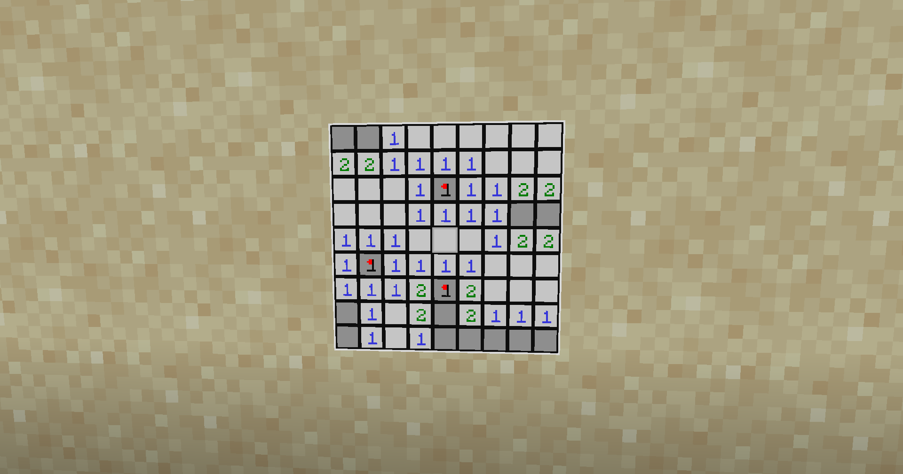

# BKMinesweeper

<a href="https://www.gnu.org/licenses/gpl-3.0.html"></a>
<a href="https://www.spigotmc.org/resources/bkcommonlib.39590/"></a>
<a href="https://github.com/bbayu123/bkminesweeper-poc"></a>
<a href="https://discord.gg/wvU2rFgSnw"></a>

BKMinesweeper is a SpigotMC plugin that lets players play Minesweeper on maps.

This plugin is an example of how to use the MapDisplay system in [BKCommonLib][1].



## Installation

Compile the plugin using [maven](https://maven.apache.org/).

Navigate to the root of the project, and type

```bash
mvn
```

This plugin requires [BKCommonLib][2] to function. You need to add BKCommonLib to your Spigot server 
before adding this plugin. 
This plugin should support all versions from version 1.13.2 onwards.


## Usage

To obtain a Minesweeper game, type

```
/minesweeper get
```

To control the map, either hold the map in your main hand, and use the regular movement keys 
(defaults are `W`, `A`, `S`, `D`, `Space`, `Left Shift`) to control it; or place the map in an 
item frame, and use regular interaction keys (defaults are `Left Click` and `Right Click`) to control it.

## Support

If you want more information on MapDisplays, head to the wiki page: <https://wiki.traincarts.net/p/Map_Display>

If you would like to see more examples, or want to ask for help when creating your own MapDisplay project,
reach out to us in the TeamBergerHealer discord server: <https://discord.gg/wvU2rFgSnw>

## License

This project uses the [GNU General Public License Version 3](https://www.gnu.org/licenses/gpl-3.0.html). 
For more information, see [LICENSE](LICENSE).

[1]: https://github.com/bergerkiller/BKCommonLib "Click to go to the GitHub page for BKCommonLib"
[2]: https://www.spigotmc.org/resources/bkcommonlib.39590/ "Click to go to the SpigotMC page for BKCommonLib"